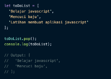
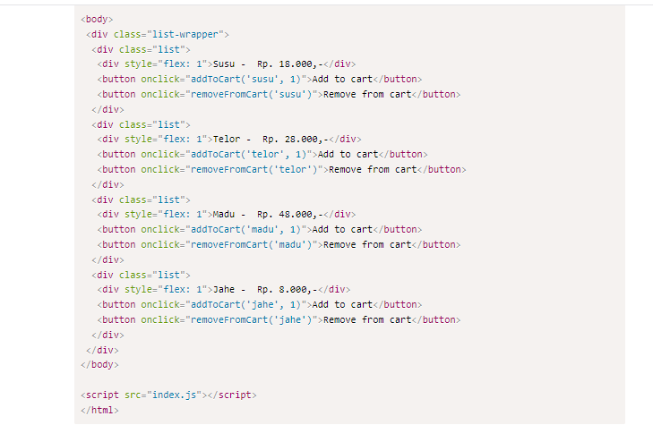

# __Writing Test Week 3__
## __JS Intermediate - Array dan Multidimensional Array__
### __Array__
- Mengorganisasi data dan menyimpan data adalah core concept dari programming.

- Array adalah tipe data list order yang dapat menyimpan tipe data apapun di dalamnya.

    Array dapat menyimpan tipe data String, Number, Boolean, dan lainnya.

- Contoh nya : 

    

    

    

- Membuat Array 
    - Array didefinisikan menggunakan square brackets

         

- Mengakses atau Memanggil Array 
    - Array pada javascript dihitung dari index data ke-0.

        Data pertama adalah index ke-0.

        

        

        

        

        

        

- Update Array
    - Seperti tipe data dan variabel pada umumnya, kita dapat mengupdate data pada Array

        

- Const in Array
    - Jika menggunakan let, kita dapat mengubah array  dengan array baru dan konten nilai yang ada di dalam array dengan nilai lain
    - Const tidak bisa melakukan update data. Namun pada Array kita dapat melakukan update konten nilai di dalam array (mutable).
    - Yang tidak bisa adalah mengubah array dengan array yang baru jika menggunakan const

        

        

        

- Array Properties
    - Array memiliki 5 properti yang sering digunakan yaitu constructor, length, index, input, dan prototype.
    - Properties adalah fitur yang sudah disediakan oleh Javascript untuk memudahkan developer.
    - length

        length akan mengembalikan nilai dari jumlah panjang data suatu array.

        

- Array Method
    - Array memiliki method atau biasa disebut built-in methods.

        Artinya Javascript sudah memudahkan kita dengan menyediakan function/method umum yang bisa kita gunakan.

        Kita tidak perlu membuat function lagi jika method yang kita butuhkan sudah tersedia.

        Sama halnya dengan Array properti. 

- Contoh Array Built-in Methods
    - .push()

        .push() adalah method untuk menambahkan item  array pada urutan yang paling akhir.

        

    - .pop()

        .pop() adalah method yang menghapus item array index terakhir.

        
    
    - .shift()

        .shift() adalah method untuk menghapus item Array pada index pertama

        

    - .unshift()

        .unshift() adalah method untuk menambahkan item Array pada index pertama

         

    - .sort()

        .sort() adalah method untuk mengurutkan secara Ascending atau Descending Alphanumeric

        

- Looping pada Array
    - Array memiliki built in methods untuk melakukan looping yaitu .map() dan .forEach()

        Kita harus tahu kapan menggunakan .map() dan juga .forEach()

    - .forEach()

        .forEach() adalah method untuk melakukan looping pada setiap elemen array.

        

    - .map()

        .map() melakukan perulangan/looping dengan membuat array baru.

         

         

         

         Kita bisa lihat bahwa .map() dan forEach() sama-sama melakukan looping dan mengembalikan nilai baru dari operasi yang dilakukan

         Perbedaannya adalah .forEach tidak dapat membuat Array baru dari hasil operasi yang ada dalam looping

        Lalu dari segi performance juga sangat jauh.

        

        Jadi, gunakan .forEach() jika hanya memerlukan looping untuk menampilkan saja atau menyimpan ke database.

        Gunakan .map() jika akan melakukan operasi pada array seperti yang dapat mengubah nilai array sebelumnya.

### __Multidimensional Array__

- Multidimensional Array bisa dianalogikan dengan array of array.

    Ada array didalam array.

    

    

    Bayangkan multidimensional ini seperti Table.

    Baris pada table itu menunjukan jumlah array.

    Column pada table itu menunjukan isi dari tiap array.

    

- Akses index multidimensional array

    

    Sama seperti array satu dimensi, multidimensional array juga dapat menggunakan Property dan Method built-in Array.

    

- Operation using map in multidimensional array
    
    

    

- LOOPING FOR MULTIDIMENSIONAL ARRAY

    

    

    Tampilan pada web 

    

<hr>

## __JavaScript Object__
- Object didunia nyata dapat kita modelkan didalam programming.

    Jadi pada programming, object adalah sebuah tipe data pada variabel yang menyimpan properti dan fungsi (method)

- Properti adalah data lengkap dari sebuah object.

- Method adalah action dari sebuah object. Apa saja yang dapat dilakukan dari suatu object.

- Membuat sebuah object
    - Sama seperti tipe data sebelumnya. Object dapat diassign kedalam sebuah variabel.

        
        Object person

        
        Object person dengan properti

    Sama seperti array, didalam object kita dapat menyimpan properti dengan tipe data apapun.

- Mengakses Object dan Property Object
    
    

    Mengakses seluruh object

    

    Data pada console log

    

    Gunakan single quote pada key jika menggunakan spasi seperti ‘current address’

    

    Mengakses properti object

    

    Data pada console log

    - Bracket Notation

        Kita juga bisa menggunakan bracket notation saat memanggil properti dari sebuah object.

        

- Update Object

    Kita dapat melakukan update pada variabel dengan tipe data Object.

    - Do’s
        - Object dapat mengupdate value dari key yang sudah tersedia

        - Object dapat menambahkan key dan value baru

        

        Update data pada Object

    - Dont’s

        Jika menggunakan constant pada variable object. Kita tidak bisa mengganti seluruh data object dengan object yang baru.

        

         Jadi jika membutuhkan untuk update seluruh data object gunakan ‘let’ pada saat deklarasi variabel.

         
         Update data object harus menggunakan let pada deklarasi variabel

- Delete Object Property

    Kita dapat menghapus properti dari object menggunakan delete operator.

    

    Delete property object age dari data people

- Method 

    Jika value yang kita masukkan pada property berupa function itu disebut method.

    console adalah global javascript object.

    log() adalah property yang berupa function dari object console.

    Sehingga kita memanggila dengan cara console.log

    Kita bisa membuat method custom untuk kita gunakan pada aplikasi kita loh.

    Kita akan membuat method untuk greeting pada aplikasi ecommerce misalnya.

    

- Nested Object

    Object yang berasal dari turunan object lainnya.

    

- Pass by reference

     mengubah data yang ada pada object melalui sebuah function dan memasukkan object sebagai parameter function ini biasa disebut passed by reference.

    

- Looping Object

    menampilkan seluruh object properti. Kita bisa menggunakan looping.

    Jadi tidak perlu mengakses secara manual memanggil setiap propertiny

    

    

- Array of Object

    Object sama seperti Array yang bisa menyimpan banyak data.

    Kita dapat menggunakan array of object untuk data yang lebih dari satu.

    
    
    Looping pada Data array of object students

    

    Hasil looping array of object pada console


<hr>

## __JavaScript Recursive__

- Recursive adalah function yang memanggil dirinya sendiri sampai kondisi tertentu.

- Recursive kebanyakan digunakan untuk case matematika, fisika, kimia, dan yang berhubungan dengan calculation.

- Struktur recursive

    

    

    Recursive akan berhenti memanggil dirinya sendiri jika kondisi terpenuhi

- Ciri dari rekursif:

    - Fungsi rekursif selalu memiliki kondisi yang menyatakan kapan fungsi tersebut berhenti. Kondisi ini harus dapat dibuktikan akan tercapai, karena jika tidak tercapai maka kita tidak dapat membuktikan bahwa fungsi akan berhenti, yang berarti algoritma kita tidak benar.

    - Fungsi rekursif selalu memanggil dirinya sendiri sambil mengurangi atau memecahkan data masukan setiap panggilannya. Hal ini penting diingat, karena tujuan utama dari rekursif ialah memecahkan masalah dengan mengurangi masalah tersebut menjadi masalah-masalah kecil.

    Contoh :

    

    Fungsi rekursif menghitung mundur number

    

    Mencari hasil dari nilai pangkat dengan rekursif

## __Modules__

- Module adalah sebuah cara bagi JavaScript untuk mengisolasi kode dari suatu file ke dalam sebuah file terpisah. Sehingga kode tersebut dapat digunakan berulang kali dengan cara di-export dari suatu file dan di-import ke file yang lainnya. Kita dapat melakukan export kode apapun pada JavaScript seperti string, object, array, number, hingga function.

- Membuat module pada lokal direktori kita

    menggunakan syntax dari versi JavaScript ES6 seperti pada kelas JavaScript Dasar. Kamu cukup menambahkan attribute type pada tag script kemudian isi nilainya dengan module.

    ```
    <script type="module" src="index.js"></script>
    ```

- Export and Import
    - Export

        Export digunakan untuk meng-export variabel pada file JavaScript. Variabel yang di_export_ dapat berisi data seperti string, object, array, hingga function. Hal ini dilakukan agar file JavaScript tersebut dapat dijadikan sebuah module, sehingga variabel yang telah di-export dapat digunakan pada file JavaScript lain dengan menggunakan import.

        Contoh dasar melakukan export pada variabel :
        ```
        export let name = "Thoriq";
        ```

        Kita juga bisa melakukan export pada objek JavaScript:
        ```
        export let orang = {
         nama: "Thoriq",
         umur: 25,
         alamat: "Jl. Kemang Raya",
        };
        ```

        Selain variabel dan objek kita juga bisa meng-export sebuah function:
        ```
        export function sayHello(user) {
          console.log(`Hello, ${user}!`);
        }
        ```

        Lalu kita juga bisa meng-export variabel objek dan function sekaligus:
        ```
        export let name = "Thoriq";
        export let orang = {
          nama: "Thoriq",
          umur: 25,
          alamat: "Jl. Kemang Raya",
        };

        export function sayHello(user) {
          console.log(`Hello, ${user}!`);
        }
        ```
      Atau juga bisa melakukan export secara terpisah untuk semua kode yang ingin kita export seperti contoh di bawah ini:
      ```
        let name = "Thoriq";

        let orang = {
         nama: "Thoriq",
         umur: 25,
         alamat: "Jl. Kemang Raya",
        };

        function sayHello(user) {
          console.log(`Hello, ${user}!`);
        }

        // Mengexport variable name, object orang dan function sayHello sekaligus
        export { name, orang, sayHello };
        ```

    - Import

        import digunakan untuk menggunakan variabel yang sudah di-export dari module lainnya.

        Contoh dasar melakukan import variabel :
        ```
        import { data } from "./namaModul.js";
        ```

- Export As dan Import As
    - Export As

        Penggunaan export as hanya bisa dilakukan dengan export secara sekaligus di akhir kode.
        ```
        export namaVariabelLama as namaVariabelBaru;
        ```

        Contohnya :
        ```
        const warna = "Merah";
         nama: "Thoriq",
         umur: 25,
         alamat: "Jl. Kemang Raya",
        };
        function katakanHalo(user) {
          console.log(`Hello, ${user}!`);
        }
        export { warna as color, orang as person, katakanHalo as sayHello };

    - Import As

        ```
        import { namaVariabelLama as namaVariabelBaru } from "./namaModul.js";
        ```

        Contoh nya :
        
        

- Export Default

    Biasanya export default digunakan untuk membuat salah satu variabel menjadi data utama yang akan di-export pada sebuah module. export default juga bisa digunakan jika hanya ada satu variabel pada suatu module.

    Penggunaannya sama seperti export biasa, kamu cukup menambahkan kata kunci default setelah export.
    ```
    export default data;
    ```
    Contoh nya :
    ```
    // greeting.js
    function sayHello(user) {
      console.log(`Hello, ${user}!`);
    }

    export default sayHello;
    ```


## __Web Storage__

- Ada beberapa cara untuk menyimpan data pengguna seperti pencarian, artikel berita, dan lain-lain ke lokal (browser) menggunakan web storage seperti cookies, local storage, dan session storage. Data ini dimanfaatkan oleh situs web tersebut untuk merekam kebiasaan pengguna agar dapat memberikan rekomendasi sesuai preferensi si pengguna tersebut.

- Ada beberapa cara untuk menyimpan data pengguna seperti pencarian, artikel berita, dan lain-lain ke lokal (browser) menggunakan web storage seperti cookies, local storage, dan session storage. Data ini dimanfaatkan oleh situs web tersebut untuk merekam kebiasaan pengguna agar dapat memberikan rekomendasi sesuai preferensi si pengguna tersebut.

- Namun ada beberapa kekurangan dari cookies di antaranya :
    - Setiap kita mengakses situs web, cookies juga kembali dikirim sehingga memperlambat aplikasi web kamu dengan mengirimkan data yang sama.
    - Cookies disertakan pada setiap HTTP request, sehingga mengirimkan data yang tidak dienkripsi melalui internet, maka saat kita ingin menyimpan data dalam cookies kita harus mengenkripsinya terlebih dahulu.
    - Cookies hanya dapat menyimpan data sebanyak 4KB.
    - Lalu cookies juga memiliki tanggal kadaluarsa. Tanggal ini telah ditentukan sehingga web browser bisa menghapus cookies jika tanggal sudah kadaluarsa atau tidak dibutuhkan.

- Local Storage dan Session Storage

    Dengan memanfaatkan local storage dan session storage, kita dapat menyimpan data lebih besar yaitu 5MB per page tanpa mempengaruhi kinerja situs web.

-  Local Storage - Menyimpan Data

    Local storage memiliki karakteristik sebagai berikut:
    - Menyimpan data tanpa tanggal kadaluarsa.
    - Data tidak akan dihapus ketika web browser ditutup dan akan tersedia seterusnya selama kita tidak menghapus data local storage pada web browser.
    - Dapat menyimpan data hingga 5MB.
    - Hanya dapat menyimpan data string.

    Untuk menyimpan data pada local storage, kita menggunakan method setItem() yang membutuhkan 2 parameter. Parameter pertama adalah key yang ingin kita simpan dan parameter kedua adalah data (value) dari key yang akan disimpan.
    ```
    localStorage.setItem('key', value);
    ```

    - Langkah 1 - Buat file index.html

    Berikut kode yang ada pada file index.html:
    ```
    <!DOCTYPE html>
    <html lang="en">
    <head>
        <meta charset="UTF-8">
         <meta name="viewport" content="width=device-width, initial-scale=1.0">
        <title>Document</title>
        <style>
            body {
                display: flex;
                flex-direction: column;
                justify-content: center;
                align-items: center;
            }

            form {
            display: flex;
            flex-direction: row;
            }

            form input {
            padding: 5px 10px;
            }
        </style>
      </head>
      <body>
        <form>
            <input type="text" id="searchkey" name="searchkey" placeholder="Search Something"><br>
            <input type="submit" value="Search" onclick="onSearch()">
        </form> 
     <script></script>
    </body>
    </html>
    ```

    Jika kode di atas dijalankan, maka akan terlihat tampilan web seperti gambar di bawah ini:

    

    - Langkah 2 - Isi tag ```<script>``` dengan fungsi ```onSearch()```

    Berikutnya kita akan membuat kode JavaScript di dalam tag ```<script>```. Jika user klik tombol Search, maka function ```onSearch()``` akan dipanggil dan menjalankan kode di dalamnya. Berikut kode yang ada pada tag ```script```:
    ```
    var searchList = [];
    function onSearch() {
        var searchValue = document.getElementById('searchkey').value;
        searchList.push(searchValue) // memasukan kata pencarian ke dalam array

         var searchListString = JSON.stringify(searchList); // mengubah array menjadi string
        localStorage.setItem('searchKey', searchListString); // menyimpan pencarian dengan key 'searchKey'
      }
    ```

   Dari kode di atas dapat kita lihat bahwa kata yang telah dicari dimasukan ke dalam array. Hal ini bertujuan agar kita dapat menyimpan kata yang dicari pengguna sebanyak mungkin. Kemudian kita juga menggunakan JSON.stringify() untuk merubah array searchList menjadi string, hal ini dilakukan karena data yang dapat disimpan ke dalam local storage hanya tipe data string. 

   Maka pada saat kita mengetik skilvul pada input, lalu klik tombol Search, kita dapat melihat data yang tersimpan dalam local storage browser kita dengan cara:

    - Klik kanan pada halaman aplikasi web yang sedang diakses. Pilih inspect.
    - Pilih dan klik Application. Lalu klik Local Storage di sisi tab sebelah kiri. Hasil yang didapatkan adalah seperti ini:

        

- Local Storage - Mengambil Data

    Untuk mengambil data yang telah tersimpan pada local storage, kita dapat menggunakan method getItem() yang membutuhkan 1 parameter. Parameter tersebut adalah key dari data yang kita inginkan.
    ```
    localStorage.getItem('key');
    ```

    - Langkah 1 - Modifikasi file index.html dari topik sebelumnya
    ```
    ...
    ...
    </form> 
    <h4>Riwayat Pencarian</h4>
    <div id="search-history"></div>
  <script>
    ...
    </body>
    </html>
    ```

    Dari kode di atas, kita menambahkan teks Riwayat Pencarian di bawah tag ```</form>``` diikuti dengan elemen ```<div id="search-history"></div>```.

    - Langkah 2 - Membuat fungsi getSearchHistory()

    Kita akan menggunakan method ```getItem()``` untuk menampilkan data searchKey pada halaman ```index.html```.
    ```
    <script>
        var searchList = JSON.parse(localStorage.getItem('searchKey')) || []; // jika searchKey bernilai undefined, maka set searchList sebagai empty array
        ...
        ...

        function getSearchHistory() {
          var list = '';
          for (var i = 0; i < searchList.length; i++) {
                list += `<div>${searchList[i]}</div>`;
            }
            document.getElementById('search-history').innerHTML = list;
        }

    // memanggil fungsi getSearchHistory
    if (searchList.length > 0) {  // Jika panjang array searchList > 0
      getSearchHistory(); // panggil fungsi getSearchHistory
        }
    </script> 
    ``` 

    Dari kode di atas, kita dapat lihat bahwa kita memodifikasi variabel searchList menjadi:
    ```
    var searchList = JSON.parse(localStorage.getItem("searchKey")) || [];
    ```

- Local Storage - Menghapus Data

    Untuk menghapus data yang telah tersimpan pada local storage, kita dapat menggunakan method removeItem() yang membutuhkan 1 parameter. Parameter tersebut adalah key dari data yang ingin kita hapus.
    ```
    // menghapus key tertentu
    localStorage.removeItem("key");

    // menghapus semua key
    localStorage.clear();
    ```
    - Langkah 1 - Buat ```<button>``` Hapus Riwayat

        Berikut detail kode yang ada pada file ``index.html``:
        ```
        <!DOCTYPE html>
        <html lang="en">
        <head>
           <meta charset="UTF-8">
        <meta name="viewport" content="width=device-width, initial-scale=1.0">
        <title>Document</title> 
      </head>
      <body>
        ...
        ...
        <h4>Riwayat Pencarian</h4>
        <div id="search-history"></div>
         <button onclick="clearSearchHistory()" style="margin-top: 20px;">Hapus Riwayat</button>
       </body>
       </html>
       ```

    - Langkah 2 - Buat fungsi clearSearchHistory()

        Kita tambahkan fungsi clearSearchHistory() dalam tag ```<script>```
        ```
        function clearSearchHistory() {
            localStorage.removeItem("searchKey"); // menghapus data pada localStorage dengan key "searchKey"
            document.getElementById('search-history').innerHTML = ""; // mengosongkan riwayat pencarian
        }
        ```

- Session Storage - Menyimpan Data

    Session storage mempunyai beberapa karakteristik, yaitu:
    - Data yang disimpan pada session storage akan terus tersimpan selama browser terbuka dan tidak hilang jika laman di-reload.
    - Membuka banyak tab/window dengan URL yang sama, akan menciptakan session storage yang berbeda di masing-masing tab/window.
    - Menutup tab/window akan mengakhiri session dan menghapus data yang tersimpan di session storage pada tab/window tersebut.
    - Data yang tersimpan dalam session storage harus berbentuk string.
    - Hanya dapat menyimpan data sebanyak 5MB.

    Sama dengan local storage, sintaks untuk menyimpan data pada session storage adalah sebagai berikut:
    ```
    // menambah session storage
    sessionStorage.setItem('key', value);
    ```

    - Langkah 1 - buat file index.html

        Isi file index.html dengan kode berikut:
        ```
        <!DOCTYPE html>
        <html>
        <head>
            <meta charset="UTF-8">
            <meta name="viewport" content="width=device-width, initial-scale=1.0">
            <title>Document</title>
            <style>
               body{
                 background: white;
                 color: #323232;
                 margin: 0;
                 height: 100vh;
                 display: flex;
                 align-items: center;
                 justify-content: center;
               }
                list-wrapper {
                  width: 50%; display: flex; flex-direction: column
                }
                .list{
                    display: flex; flex-direction: row; justify-content: space-between; margin-bottom: 10px
                }
            </style>
           </head>

           <body>
            <div class="list-wrapper">
            <div class="list">
            <div style="flex: 1">Susu -  Rp. 18.000,-</div>
            <button onclick="addToCart('susu', 1)">Add to cart</button>
            </div>
            <div class="list">
            <div style="flex: 1">Telor -  Rp. 28.000,-</div>
            <button onclick="addToCart('telor', 1)">Add to cart</button>
            </div>
            <div class="list">
            <div style="flex: 1">Madu -  Rp. 48.000,-</div>
            <button onclick="addToCart('madu', 1)">Add to cart</button>
            </div>
            <div class="list">
            <div style="flex: 1">Jahe -  Rp. 8.000,-</div>
            <button onclick="addToCart('jahe', 1)">Add to cart</button>
            </div>
           </div>
          </body>

        <script src="index.js"></script>
        </html>
        ```

        kita akan mendapatkan tampilan sebagai berikut:

        

    - Langkah 2 - buat file index.js
         ```
        let cartList = [];
        function addToCart(name, qty){
            cartList.push({
              name,
              qty
            });
            sessionStorage.setItem("carts", JSON.stringify(cartList)); // array object diubah menjadi string
        }
        ```

        kita akan mendapatkan hasil sebagai berikut:

        

    - Langkah 3 - modifikasi function addToCart

        

        Hasil dari kode di atas akan melakukan update qty menjadi seperti ini:

        

- Session Storage - Mengambil Data

    Sama seperti local storage, cara mendapatkan data dari session storage juga menggunakan getItem(), seperti berikut ini:
    ```
    // mendapatkan session storage
    sessionStorage.getItem('key');
    ```
    - Langkah 1 - Membuat menu View Cart

        Kita akan menambahkan baris kode berikut pada file index.html dari topik sebelumnya:
        ```
        <div class="list-wrapper">
          ...
          ...
           <div style="margin-top: 15px;"><a href="cart.html">View Cart</a></div>
        </div>
        ```
        Sehingga hasilnya menjadi seperti ini:

        

    - Langkah 2 - Membuat file cart.html

        Tambahkan kode berikut ini ke dalam file cart.html yang telah kita buat:

        
        

        Dari kode di atas, dapat kita lihat bahwa cart.html berisi tag ```<div>```dengan id list-cart tidak memiliki isi konten. Lalu tag ```<script>``` juga tidak lagi membaca index.js.

    - Dari kode di atas, dapat kita lihat bahwa cart.html berisi tag ```<div>``` dengan id list-cart tidak memiliki isi konten. Lalu tag ```<script>``` juga tidak lagi membaca index.js.

        

        Jika file cart.html dijalankan, maka hasilnya akan menjadi seperti ini:

        

        Dapat kita lihat bahwa dari kode di atas, kita mendapatkan apa yang ada di keranjang belanja dengan cara:
        ```
        var cartList = JSON.parse(sessionStorage.getItem('carts'));
        ```

- Session Storage - Menghapus Data

    Syntax untuk menghapus data dari session storage ada 2, yaitu:
    ```
    // menghapus session storage satu persatu berdasarkan key
    sessionStorage.removeItem('key');
    ```
    ```
    // menghapus seluruh session storage sekaligus
    sessionStorage.clear();
    ```
    - Langkah 1 - Tambahkan button Remove from cart

        Kita akan menambahkan beberapa baris kode pada file index.html sebelumnya untuk membuat button Remove from Cart pada setiap produk:

        
        

        Jika kode diatas dijalankan maka akan didapatkan hasilnya seperti berikut ini:

        

    - Langkah 2 - Buat function removeFromCart()

        
        Hasilnya akan seperti ini :

        

    - Langkah 3 - Buatlah button Empty Cart

        Buatlah sebuah button bernama Empty cart pada file index.html sebelumnya seperti berikut ini:
        ```
        <div class="list-wrapper">
           <div style="margin-bottom: 15px;"><button onclick="emptyCart()">Empty cart</button></div>
            ...
            ...
        </div> 
        ```  


        Letakkan button Empty cart tepat dibawah class="list-wrapper". Sehingga tampilannya akan menjadi seperti ini:

        

    - Langkah 4 - Buat function emptyCart()

        Terakhir, buatlah sebuah function bernama emptyCart() pada file index.js sebelumnya:
        ```
        function emptyCart() {
            sessionStorage.removeItem('carts'); // menghapus session storage 'carts'
            cartList = []; // menjadikan cartList sebagai array kosong kembali
        }
        ```


        


    


    


    


